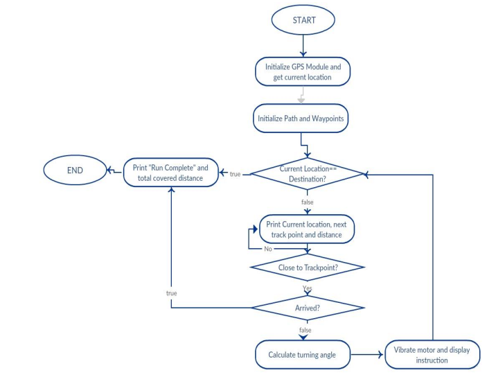

# GPS Navigator

**Description**

This is a GPS navigator specially designed for runners by which they will be guided
to a predefined route through haptic feedback and navigation message displayed
on LCD display.
Here a GPS module (GY-GPSMV2) is used to get user’s current location (latitude
and longitude) and two vibrator motors are used to indicate turn. A 16x2 LCD
screen works as user interface and one push button is used to start or stop
navigation.
When user presses the push button, the GPS module start sending data in NMEA
string. MCU controls the speed of data connection and update rate. After getting
valid NMEA sentence, it parses those strings and extract current location. MCU
then matches the route with user’s current location and make decision whether user
should be notified to turn or not. There are two vibration motors, one will be
placed in user’s left hand and other in user’s right hand. When user needs to turn
left, the left one will vibrate and the right one is vibrated when user needs to turn
right. So, user can intuitively keep running on his desired route without
interruption. While the user is running, the LCD display will keep showing current
location, covered distance till now, how far destination is, average speed and
navigation message. Finally after completing the run, LCD will display total
covered distance by runner.

**Features Implemented**
1. Navigation message display
2. Turn indicating navigation by vibration motor
3. Current location display
4. Average speed of runner display
5. Distance covered till now display
6. Distance left to reach destination display
7. Total covered distance display
8. Start and stop navigation with push button

 

**Interfacing GPS Module**

This GPS module has 4 pins—VCC, GND, TX, RX. To feed the module 5V, we
have used the 7805 IC to get 5V from 9V battery. Here only TX pin is used to
transfer data to ATMega32. This TX pin is connected with RX pin of MCU so that
MCU can receive the data.
To interface with this module, baud rate has been defined 9600bps. Asynchronous
serial communication (UART) is used to communicate with GPS. It is configured
as no parity, one stop bit and double speed transmission.
Additional Libraries
No library needed to interface GPS module. Only one library “lcd.h” is needed
throughout the project for using LCD module.
Challenges and Approaches to Overcome Those
1. Interfacing with gps module is troublesome. Gps module rarely connects
with satellite inside building. So we need to go outside or sit beside window
to get data from gps. Again, gps does not get connection if the sky is cloudy
or it is raining. So most of the time, we needed to depend on weather.
2. The gps module that we have bought is integrated with a package to make it
more user friendly. We have the datasheet of the module but not the
datasheet of the package. So understanding how it works takes a lot of
efforts and time. We used hit and miss process, set different baud rates
mentioned at the module’s datasheet to get the exact baud rate.

**Youtube Link**
https://www.youtube.com/watch?v=sashjo0Djfg
